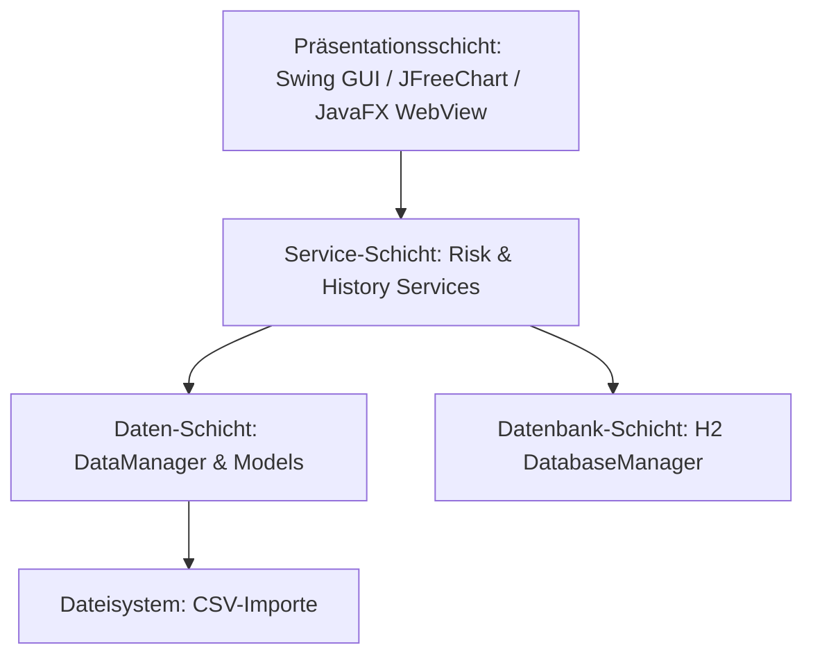

# Projektdokumentation: MqlAnalyser (MQL5 Signal Provider Analyzer)

Willkommen zur offiziellen Entwickler- und Systemdokumentation für den **MqlAnalyser**. Dieses Dokument beschreibt die Architektur, Datenmodelle, Verarbeitungsalgorithmen und die Benutzeroberfläche des Java-basierten Desktop-Tools zur detaillierten Analyse und Bewertung von Handelsaktivitäten von MQL5- und MT4-Signal-Anbietern.

---

## 1. 🎯 Projektübersicht & Zweck

Der **MqlAnalyser** (auch als *MQL5 Signal Provider Analyzer* bezeichnet) ist ein spezialisiertes Java-Desktop-Tool, das für Trader, Investoren und Risikomanager entwickelt wurde. Das Programm liest historische Handelsdaten im CSV-Format ein, führt komplexe statistische Analysen durch, berechnet proprietäre Risiko-Kennzahlen (z. B. Martingale-Erkennung und Open Equity Risk) und speichert diese Daten in einer eingebetteten H2-Datenbank, um Performance-Entwicklungen über Zeit zu verfolgen.

### Hauptziele des Systems:
*   **Automatisches Parsing** von Handelsberichten verschiedener Formate (Standard-MT4 und MQL5).
*   **Risikoanalyse** durch Erkennung riskanter Handelsstrategien (Grid-Trading, Martingale, extreme Lot-Größen-Exposition).
*   **Historisches Tracking** von Statistiken über eine eingebettete SQL-Datenbank zur Erkennung von Performance-Verschlechterungen (Drawdown-Anstieg, Profit-Factor-Verfall).
*   **Generierung professioneller HTML-Reports** mit integrierten Charts für ausgewählte Favoriten.

---

## 2. 🏗️ Systemarchitektur & Layer

Das Projekt folgt einer klaren Schichtenarchitektur, um Geschäftslogik, Datenhaltung und Benutzeroberfläche voneinander zu trennen.



### Modulübersicht
1.  **Presentation Layer (`ui` & `ui.components` & `ui.dialogs`)**: 
    *   Basiert auf **Java Swing** für die Benutzeroberfläche und integriert **JavaFX WebView** zur Einbettung von MQL5-Webseiten.
    *   Verwendet **JFreeChart** zur Visualisierung von über 15 spezialisierten Performance- und Risikodiagrammen.
2.  **Service Layer (`services`)**:
    *   [RiskAnalysisServ](file:///d:/git/MQL/MqlAnalyser/src/services/RiskAnalysisServ.java): Berechnet Risiko-Scores und klassifiziert Provider.
    *   [ProviderHistoryService](file:///d:/git/MQL/MqlAnalyser/src/services/ProviderHistoryService.java): Automatisiert das Speichern historischer Werte.
3.  **Data Layer (`data` & `models`)**:
    *   [DataManager](file:///d:/git/MQL/MqlAnalyser/src/data/DataManager.java): Singelton-Klasse, die das Laden und Parsen von CSV-Dateien übernimmt.
    *   [Trade](file:///d:/git/MQL/MqlAnalyser/src/data/Trade.java): Datenmodell für einzelne Trades.
    *   [ProviderStats](file:///d:/git/MQL/MqlAnalyser/src/data/ProviderStats.java): Repräsentiert die aggregierten Kennzahlen eines Anbieters.
4.  **Database Layer (`db`)**:
    *   [HistoryDatabaseManager](file:///d:/git/MQL/MqlAnalyser/src/db/HistoryDatabaseManager.java): Kapselt den Zugriff auf die eingebettete **H2-Datenbank**.
5.  **Reporting Layer (`reports`)**:
    *   [ReportGenerator](file:///d:/git/MQL/MqlAnalyser/src/reports/ReportGenerator.java) und [HtmlPdfIntegrator](file:///d:/git/MQL/MqlAnalyser/src/reports/HtmlPdfIntegrator.java): Erstellen strukturierte Berichte.

---

## 3. 📁 Datenmodell & CSV-Import

Der Datenimport ist in [DataManager](file:///d:/git/MQL/MqlAnalyser/src/data/DataManager.java) implementiert. Die CSV-Dateien werden zeilenweise eingelesen, wobei das System flexibel auf Formatunterschiede reagiert:

### Format-Erkennung
Das System prüft den Header der CSV-Dateien, um zwischen zwei Hauptformaten zu unterscheiden:
1.  **MQL5-Format**:
    *   Erkennbar an mindestens 11 Spalten, wobei das erste und siebte Feld `"Time"` lautet und das sechste Feld ein dupliziertes `"Volume"` ist.
    *   *Besonderheit*: Der Gewinn (*Profit*) wird von MQL5 als ganze Zahl exportiert und muss durch einen Skalierungsfaktor (in der Regel `100.0`) geteilt werden, um den echten Währungswert zu erhalten.
2.  **Standard-MT4-Format**:
    *   Kann Spalten für Stop Loss (S/L) und Take Profit (T/P) enthalten oder direkt zur Schließzeit springen.
    *   Der Start-Saldo (*Initial Balance*) wird aus der ersten Zeile ermittelt, die mit `"Balance"` oder `"Credit"` deklariert ist. Falls dieser Eintrag fehlt (z.B. im MQL5-Format), wird ein Standardwert von `1000.0` angenommen.

### Trade-Eigenschaften
Jede Transaktion wird in einem [Trade](file:///d:/git/MQL/MqlAnalyser/src/data/Trade.java)-Objekt mit folgenden Attributen abgebildet:
*   Öffnungs- und Schließzeit (`LocalDateTime`)
*   Order-Typ (Buy/Sell/Balance)
*   Symbol (Währungspaar, z. B. EURUSD)
*   Lots (Positionsgröße)
*   Eröffnungs- und Schlusskurs
*   Stop Loss (S/L) & Take Profit (T/P)
*   Kommission & Swap
*   Realisierter Profit/Loss

---

## 4. 💾 H2-Datenbank & Datenintegrität

Die Persistierung erfolgt über [HistoryDatabaseManager](file:///d:/git/MQL/MqlAnalyser/src/db/HistoryDatabaseManager.java) mittels einer eingebetteten **H2-Datenbank** im Datei-Modus (gespeichert unter `%ROOT_PATH%\database\providerhistorydb`).

### Datenbankschema
*   `signal_providers`: Speichert eindeutige Namen der Signal-Provider.
*   `stat_values`: Speichert zeitgestempelte Performance-Werte (z. B. 3MPDD, Profit Factor, Drawdown). Durch ein Unique-Constraint (`provider_id, stat_type, recorded_date`) sind doppelte Einträge ausgeschlossen.
*   `provider_notes`: Verwaltet Notizen und eine benutzerdefinierte Risiko-Kategorie (0–10) pro Provider.
*   `db_change_log`: Protokolliert alle Schema-Änderungen, Backups und Integritätsprüfungen.

### Datenintegrität & Sicherheit
*   **Integritätsprüfung (`checkDataIntegrity`)**: Beim Schließen der Anwendung oder bei wöchentlichen Kontrollen gleicht das System die Anzahl der aktuellen Einträge mit dem letzten aufgezeichneten Stand im Änderungslog ab. Wird ein plötzlicher Datenverlust festgestellt, schlägt das System Alarm (`INTEGRITY_WARNING`) und erstellt sofort ein automatisches Backup.
*   **Automatisches Backup (`createBackup`)**: Führt bei jedem regulären Schließen der Verbindung den SQL-Befehl `BACKUP TO '...'` aus, um die Datenbank in ein verschlüsseltes ZIP-Archiv im Backup-Verzeichnis zu sichern.
*   **Kein Überschreiben historischer Daten**: Statistische Werte werden ausschließlich als neue Einträge mit aktuellem Zeitstempel hinzugefügt. Das Überschreiben oder Löschen historischer Werte ist im regulären Betrieb gesperrt.

---

## 5. 🧮 Risiko- & Performance-Metriken

Die zentrale Risikoklassifizierung erfolgt im [RiskAnalysisServ](file:///d:/git/MQL/MqlAnalyser/src/services/RiskAnalysisServ.java). Der berechnete **Risk Score (1–100)** setzt sich gewichtet aus fünf Komponenten zusammen:

| Risikokomponente | Gewichtung | Berechnungsbasis |
| :--- | :--- | :--- |
| **Martingale Detection** | 25% | Analyse von aufeinanderfolgenden Verlusttrades und nachfolgenden Lot-Vergrößerungen. |
| **Open Equity Risk** | 25% | Berechnung der maximalen zeitgleichen Lot-Exposition aller offenen Positionen. |
| **Concurrent Trading Risk** | 20% | Maximale Anzahl zeitgleich aktiver Orders und deren kumulierte Lot-Größen. |
| **Drawdown Risk** | 15% | Maximaler historischer prozentualer Kontoverlust. |
| **Profit Factor Stability** | 15% | Kontinuität und Robustheit des Profit-Faktors (Abwertung bei Werten nahe oder unter 1.0). |

### Algorithmus: Martingale-Erkennung
Das Martingale-System erhöht die Positionsgröße nach einem Verlust, um diesen auszugleichen. Der Erkennungs-Algorithmus in `analyzeMartingalePattern` arbeitet wie folgt:
1.  Sortierung aller Trades nach `openTime`.
2.  Tritt ein Trade mit negativem Ergebnis (`profit < 0`) auf, wird das Lot-Verhältnis des nachfolgenden Trades berechnet: `ratio = currentLots / prevLots`.
3.  Ist das Verhältnis `ratio > 1.5`, wird dies als Martingale-Schritt gewertet und die Sequenz-Länge erhöht.
4.  Der Score steigt drastisch mit der Anzahl aufeinanderfolgender Erhöhungen sowie mit der absoluten Lot-Größe innerhalb der Verlustsequenz.

---

## 6. 🖥️ Benutzeroberfläche & JFreeChart-Visualisierungen

Die UI ist modular aufgebaut und trennt die Tabellenverwaltung, das Event-Handling und das Rendering.

### Hauptfenster & Tabelle
*   [MainFrame](file:///d:/git/MQL/MqlAnalyser/src/ui/MainFrame.java): Baut das Hauptfenster auf und delegiert Aufgaben an Hilfsmanager wie `MenuManager` und `ToolbarManager`.
*   [MainTable](file:///d:/git/MQL/MqlAnalyser/src/ui/components/MainTable.java): Die Tabelle verwendet ein spezialisiertes [HighlightTableModel](file:///d:/git/MQL/MqlAnalyser/src/models/HighlightTableModel.java). 
*   **Farb-Renderer**:
    *   `HighlightRenderer`: Hebt Favoriten (farbliche Zeilen) und als "Bad Provider" markierte Einträge (ausgegraut/rot) hervor.
    *   `RiskScoreRenderer`: Färbt den Risk Score dynamisch ein (grün bei geringem Risiko, rot bei extremem Risiko).
    *   `RisikoRenderer`: Visualisiert die manuell vergebene Risiko-Kategorie (0–10).

### Chart-Typen (JFreeChart)
Über [ChartsPanelFactory](file:///d:/git/MQL/MqlAnalyser/src/ui/components/ChartsPanelFactory.java) werden diverse Diagramme bereitgestellt:
1.  **Equity Curves**: Verlauf der Kontobilanz über alle abgeschlossenen Trades.
2.  **Equity Drawdown Chart**: Visualisiert realized Drawdown vs. das offene Risiko durch schwebende Positionen.
3.  **Trade Stacking Chart**: Zeigt die Anzahl gleichzeitig offener Trades auf einer Doppelachse zusammen mit den offenen Lots.
4.  **Duration/Profit Chart**: Ein Scatter-Plot, der zeigt, ob länger gehaltene Trades profitabler sind oder ob Verluste "ausgesessen" werden.
5.  **Currency Pair Trades Chart**: Zeigt offene Trades und Lots je Währungspaar zur Erkennung von Klumpenrisiken.

---

## 7. 📄 Report-Generator

Der Report-Generator ermöglicht den Export der Analysen als HTML-Berichte:
*   [ReportGenerator](file:///d:/git/MQL/MqlAnalyser/src/reports/ReportGenerator.java): Erstellt strukturierte HTML-Seiten für favorisierte Provider.
*   [PdfManager](file:///d:/git/MQL/MqlAnalyser/src/reports/PdfManager.java): Durchsucht das System nach PDF-Dokumenten des Providers und kopiert sie in das Report-Verzeichnis.
*   [HtmlPdfIntegrator](file:///d:/git/MQL/MqlAnalyser/src/reports/HtmlPdfIntegrator.java): Bindet die gefundenen PDFs direkt als anklickbare Links im HTML-Bericht ein und generiert dynamisch ein Inhaltsverzeichnis mit CSS-Styling.

---

## 8. 🚀 Verwendung & Konfiguration

### Starten der Anwendung
Das Projekt kann auf zwei Arten gestartet werden:
1.  **Per Batch-Skript (Empfohlen)**: Doppelklick auf die [start.bat](file:///d:/git/MQL/MqlAnalyser/start.bat) im Hauptverzeichnis. Diese führt folgenden Maven-Befehl aus:
    ```cmd
    mvn compile exec:java -Dexec.mainClass="SignalProviderTable"
    ```
2.  **Per Maven-Plugin**: 
    ```cmd
    mvn javafx:run
    ```

### Pfad-Konfiguration
Die Pfade und Einstellungen des Programms werden in der Datei `%ROOT_PATH%\config\MqlAnalyzerConfig.txt` verwaltet.
*   `downloadPath`: Ordner, in den die CSV-Dateien der Provider abgelegt werden müssen.
*   `baseUrl`: Die Ziel-URL für Webseiten-Scraping (`https://www.mql5.com/en/signals`).

> [!IMPORTANT]
> Der Root-Pfad der Anwendung ist in [ApplicationConstants](file:///d:/git/MQL/MqlAnalyser/src/utils/ApplicationConstants.java) hart auf `c:\Forex\MqlAnalyzer` codiert. Weicht der Ausführungspfad beim Start ab, wird eine Fehlermeldung per Dialog ausgegeben, um Fehlfunktionen durch falsche relative Pfade zu verhindern.
